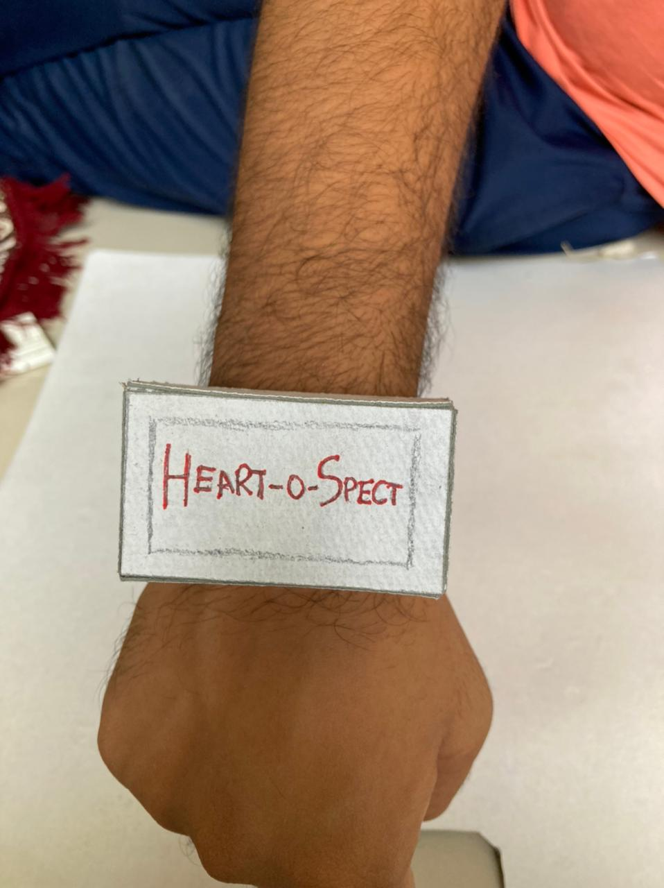
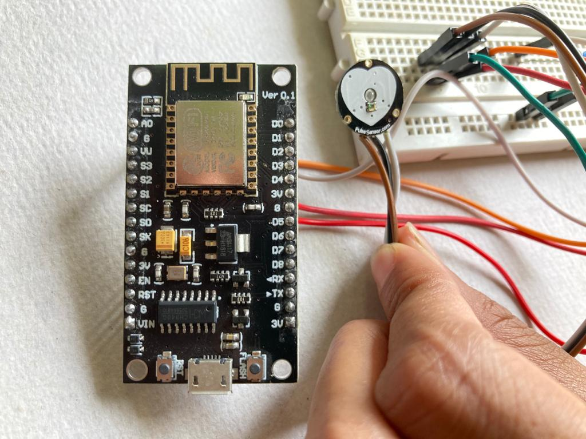

# Heart-O-Spect
    Designed a IoT enabled abnormal pulse detection and notification system.
    In a small form factor we can fashion this device as a watch for elderly people.

### Requirements:
    - Software: Arduino Ide
    - Language: C
    - Hardware:  NodeMCU and Pulse sensor
    - Other: Wifi Connection

### Implementation:
    Prototype will be in a form of cost efficient watch which
    will help to detect pulse abnormality in elderly people and 
    keep an eye on their health by notifiying gurdian or nearby hospital
    in case of emergency.

### Images:

